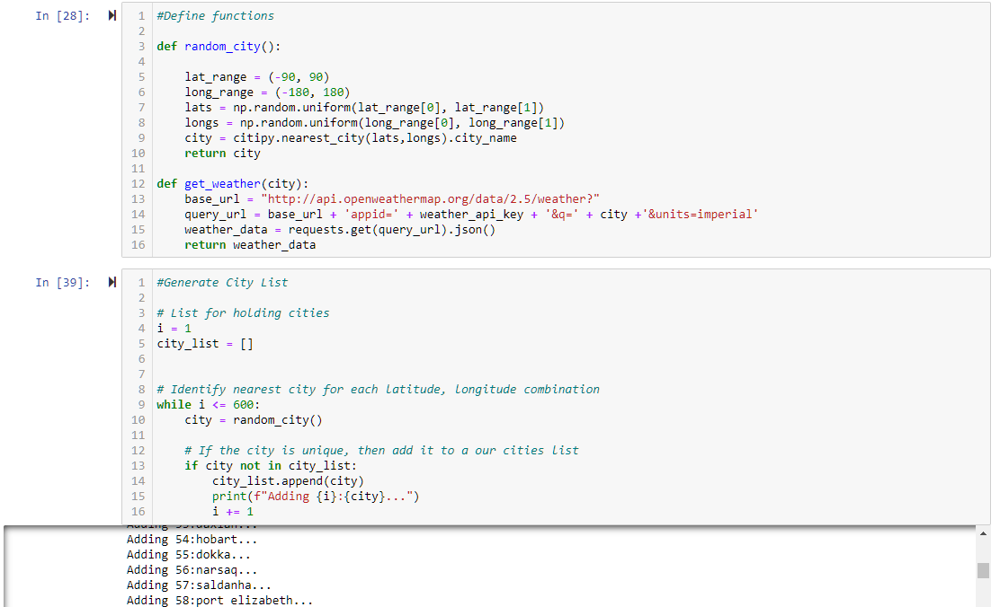
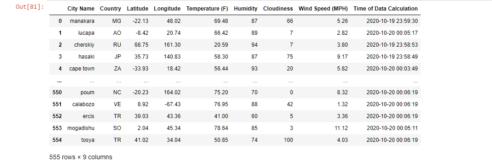
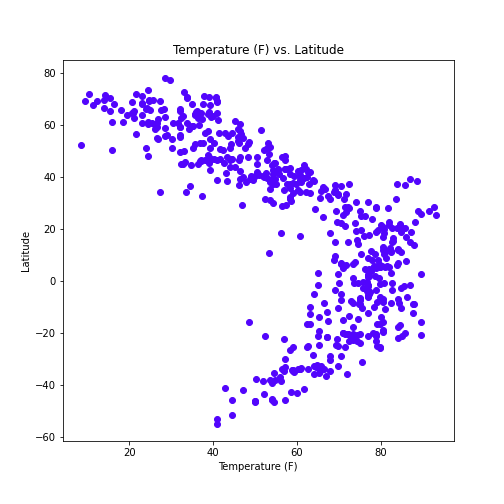
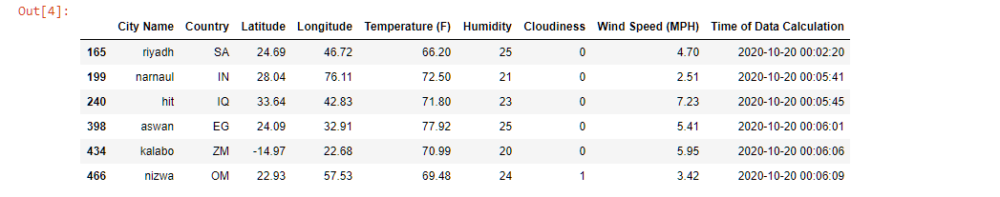
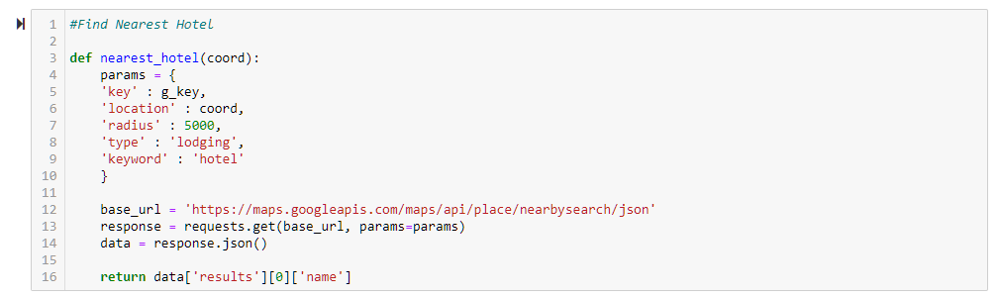
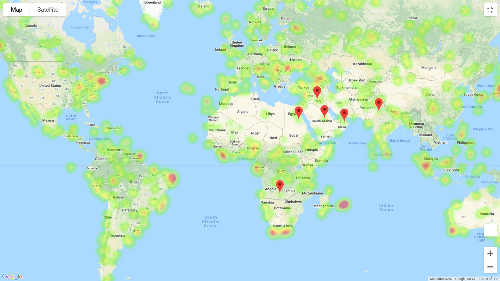

# Python APIs 

## Prompt
Using the [OpenWeatherMap API](https://openweathermap.org/api) determine if there are any oberservable waether trends in a cities around the world based on their longitude and latitude. Observe the temperature, humidty, cloudiness, and wind speed vs the latitude. Also compare northern and southern hemispheres against the same categories.

Based upon this analysis create a vacation plan with user defined conditions for the ideal cities to visit. Map the cities and provide information on available lodging.

## Process

To make the overall task more manageable the work is divided into two seperate python files (VacationPy and WeatherPy). To avoid sharing an apikey a config.py file is used to call the necessary APIs ([OpenWeather](https://openweathermap.org/api) and [Google Places](https://developers.google.com/maps/documentation/places/web-service/overview)). A gitignore file with references to the config.py helps to keep the api keys hidden while on github.

### WeatherPy 

  Dependencies
  - MatplotLib
  - Pandas
  - Numpy
  - JSON
  - citipy
  - random
  - time
  - scipy
  - api key from config.py

**Data Aquistion and Cleaning**  
There are two process that get used repeatedly in this script and require a custom function to be written. One called `random_city()` will generate our list of cities to be used in the analysis. The logic within the function generates a latitude and longitude. Then using `nearest_city()` (found within citypy) the name of the closest city will be returned. This fucntion is passed through a while loop 600 times to generate the cities that will be studied. To ensure that there are no duplicates an if statement is included within the loop.  



With this list it is now possible to get weather data for the cities in the generated list. A dataframe will hold all the data for the categories mentioned earlier. Using a loop `iterrows()`, and the custom `get_weather()` function weather data will be retreived for all the cities from the random generator. The `get_weather()` function uses the endpoint provided by Open Weather to request data from their API. The call returns JSON formatted data. We can use code like 
```
city_df.loc[index, 'Country'] = data['sys']['country'] 
```
to travel through the JSON and get the specific data we need. To prevent the loop from crashing an exception is added to skip any cities where weather data cannot be found. The cities coordinates are important for this anlysis so any cities without either are dropped. For record keeping purposes a time stamp is added for when the data was requested.



**Plotting and Regression**  
Using the columns from the dataframe as necessary (i.e. cities_df ['Temperature (F)'] for the temperature in farenheit) plots are generated. To further understand the visualizations the citites are divided in northern and southern hemispheres. To quantify any correlation between the requested categories a regression is applied to the plots. Below is one example of a plot. More plots are here: (https://github.com/NPVoravong/API-Challange/tree/main/graphs)



**Trends**    
1. The closer you get to the equator the higher the temperature gets. This has to do with how heat from the sun hits the Earth's surface. Due to the curvature of the Earth latitudes near the equator tend to receive more direct energy from the Sun.
2. Wind speed is slightly higher the further away you get from the equator. This is realted to how the surface of the Earth is heated with locations closer to the equator being generally warmer.
3. There is not correlation between latitude and cloudiness. The variables that create cloudiness rely on more than just where the latitude a city is located at.

### VacationPy  

  Dependencies
  -  Pandas
  -  Requests
  -  Gmaps
  -  OS
  -  API key from config.py

**City Selection** 
With weather data and trends we can start planning a vacation. For this trip the follwing criteria we used to narrow down the list potential cities to visit.
- Clouldiness less than or equal to 8%
- Humidity less than or equal to 25%
- Wind Speed less than or equal to 8 mph
- Temperature between 85 and 60 degrees Farenheit  

To check available lodging in these cities the custom `nearest_hotel()` function is used. This fuction uses the Google Nearby search API to search for lodging within a set radius.



Each city from the reduced list is passed through this function. If there isn't a hotel within 5,000 meters of the coordinates the city is dropped from the list.




**Mapping** 

Using gmaps all of the potential vacation cities are added to a map. The coordinates for the markers comes from the vacation dataframe. Humidity is added as a heatmap to get a better understanding of comfortable it would be outdoors in the potential vacation cities.




